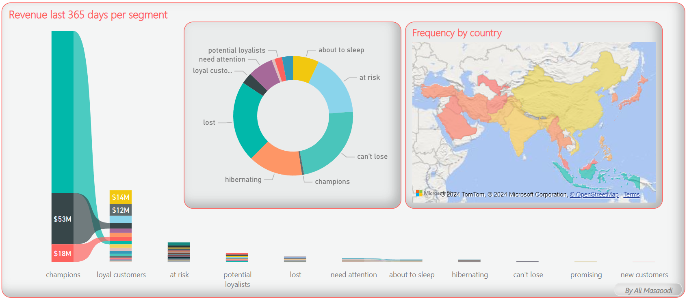
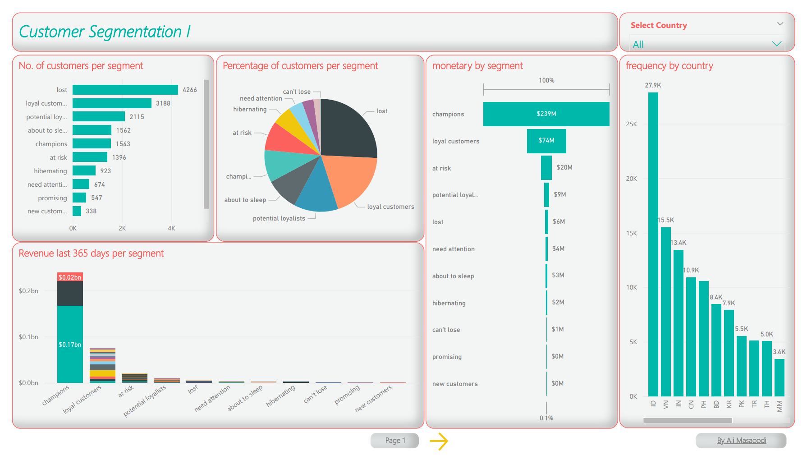
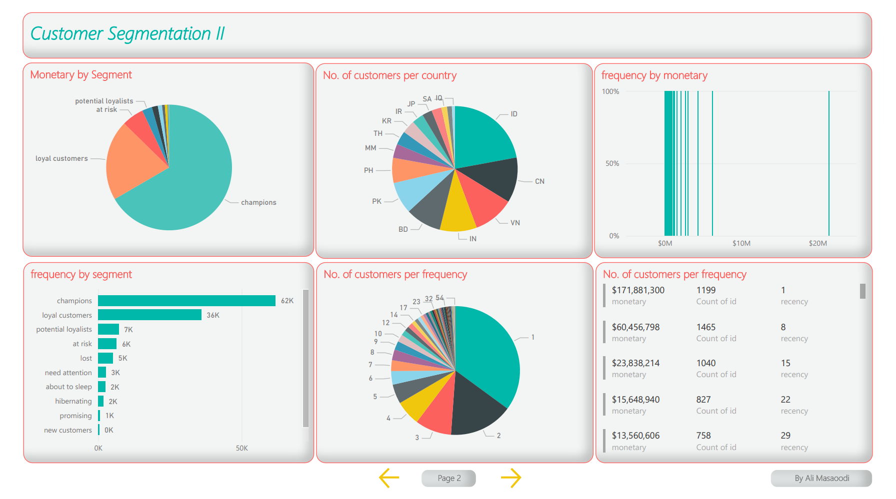
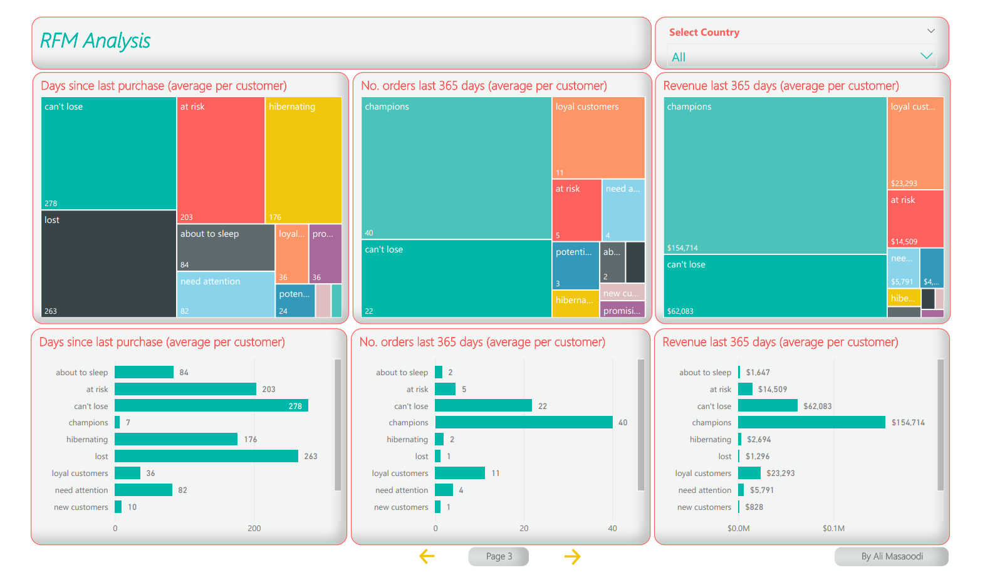
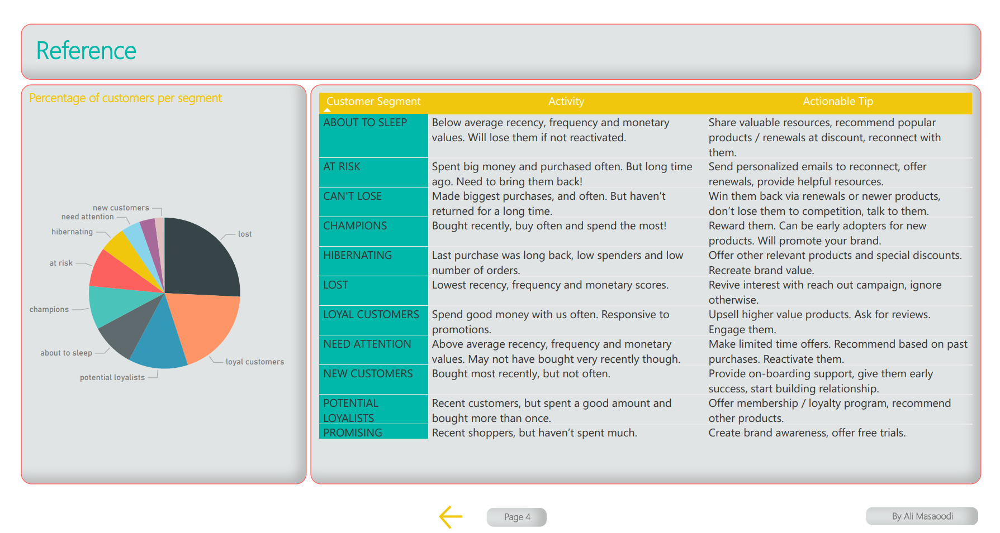

# 📊 Mall Customer Segmentation & RFM Analysis Dashboard with Power BI

This project demonstrates a data-driven approach to customer segmentation using RFM (Recency, Frequency, Monetary) analysis. It involves importing sales data from 18 countries over two years, applying segmentation techniques, and visualizing insights through a Power BI dashboard. Providing insights on customer behavior to optimize sales and retention. This allows sales managers to identify valuable customer segments to increase retention and maximize revenue.

## 🎯 Project Objectives
1. **Segment Customer Base**: Identify and categorize customer groups based on purchasing behaviors.
2. **Enhance Sales Strategies**: Aid sales teams in identifying high-potential customers for increased engagement.
3. **Optimize Customer Retention**: Use insights to proactively retain customers at risk of churning.

## 🌐 Data Acquisition
Data collected from real sales spanning 18 countries, provided in CSV format. Privacy ensured by anonymized country names, customer IDs, and revenue values. Data columns including order count, units, dates remain intact, and more.

## 📊RFM Analysis Overview
RFM (Recency, Frequency, Monetary) analysis is a powerful method for understanding customer value:
- **Recency**: How recently a customer made a purchase.
- **Frequency**: How often a customer makes a purchase.
- **Monetary**: The total revenue generated by a customer.

Using these metrics, customers are segmented into specific groups, making it easier to identify high-value customers, churn risks, and potential growth opportunities.

## Power BI Dashboard Features

### 1. Overview Page
This page provides an overview of customer segments based on their behaviors and monetary contributions.

Key metrics include:
- Number of Customers per Segment: Displays the total count of customers categorized into segments such as "champions," "loyal customers," "at risk," and others.
- Revenue Last 365 Days per Segment: Illustrates the revenue generated by each segment over the past year, highlighting which segments are most valuable.
- Percentage of Customers per Segment: Shows the distribution of customers across different segments, indicating the proportion of each group relative to the total customer base.

### 2. RFM Metrics Visualization
An interactive chart focuses on RFM analysis,, allowing users to identify high-value and at-risk customers at a glance.

RFM analysis assesses customer behavior through three dimensions:
- Days Since Last Purchase (Average per Customer): Reveals how long it has been since customers in each segment last made a purchase.
- Number of Orders Last 365 Days (Average per Customer): Indicates how frequently customers from each segment have ordered within the last year.
- Revenue Last 365 Days (Average per Customer): Provides insight into the average revenue generated by customers in each segment over the past year.

### 3. Region-Wise Insights
A reference guide to the all segments, suggesting actions per segment.

## Customer Segmentation Details
Based on the RFM analysis, customers are categorized into these segments:
- **Champions**: High frequency and spending, often recent buyers.
- **Loyal Customers**: Frequent buyers, responsive to promotions.
- **Potential Loyalists**: Recent buyers with medium frequency, potential for loyalty.
- **Recent Customers**: Latest buyers, but less frequent.
- **Promising**: Recent but low-spending customers.
- **Customers Needing Attention**: Moderate RFM scores, potentially drifting away.
- **At Risk**: Historically frequent buyers but haven't purchased recently.
- **Can’t Lose Them**: Previously frequent but inactive for a long period.
- **Hibernating**: Low frequency and recency; might require reactivation.
- **Lost**: No activity for a significant time, low likelihood of return.

## Tools and Technologies
- **Power BI**: Used for creating the interactive dashboard and performing data visualization.
- **CSV Data Format**: Sales data for import and analysis.

## License
This project is licensed under the MIT License. See the [LICENSE](./LICENSE) file for details.

About ME
---
[Ali Masaoodi](https://www.linkedin.com/in/ali-masaoodi/)
